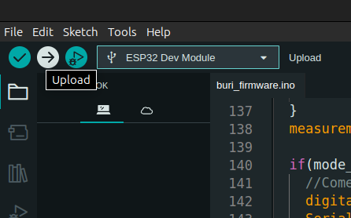

## Projeto BURI

### Autor : [Adevan Neves Santos](https://www.linkedin.com/in/adevancomp/)

### Orientador : [Prof. Jonathas Silva dos Santos](https://www.linkedin.com/in/jonathassilvasantos/)


### Configuração do firmware:

### Baixe o arduino IDE na versão 2.3.3 para o seu sistema Operacional e abra-o

### Em seguida clone o repositório na branch "feat/esp32-firmware" e abra a pasta "buri_hardware" que está dentro da firmware como projeto na IDE do Arduíno.

```bash
git clone git@github.com:adevancomp/TCC-Android-Embarcado-BURI.git -b feat/esp32-firmware firmware
```

#### Em seguida, adiciona as bibliotecas compactadas dentro da pasta libraries no Arduino IDE. O caminho é no menu superior clicar em Sketch > Include Library > Add .ZIP library. Faça isso com todas as bibliotecas e depois clique em verify para ver se o código possui algum erro de sintaxe.



#### Com tudo funcionando, conecte o esp32 no notebook através do cabo usb e clique no upload para ele compilar o código e mandar para a memória do microcontrolador.


#### Por fim, caso esteja tudo funcionando ele irá subir o ponto de acesso wifi denominado Buri-Hardware e você poderá realizar a conexão com o aparelho para configurar conforme o manual do protótipo.