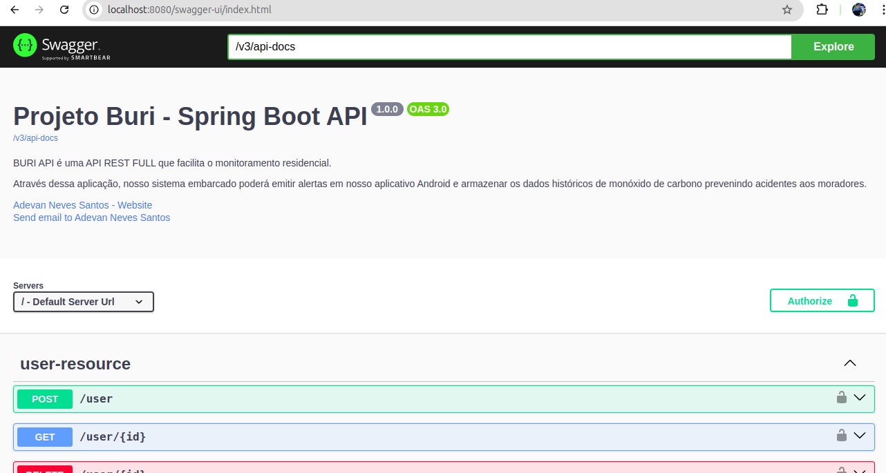
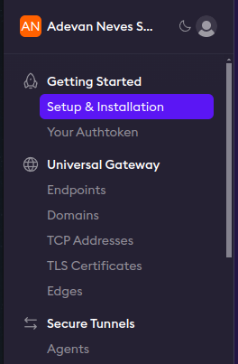
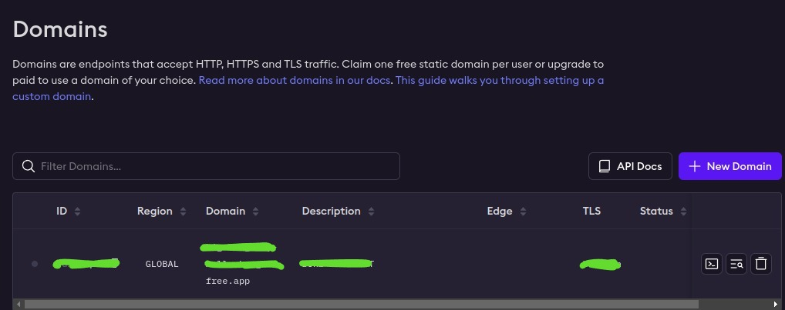
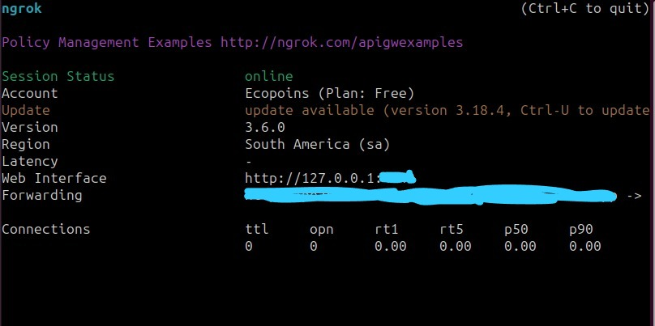

## Projeto BURI

### Autor : [Adevan Neves Santos](https://www.linkedin.com/in/adevancomp/)

### Orientador : [Prof. Jonathas Silva dos Santos](https://www.linkedin.com/in/jonathassilvasantos/)

### 1 Configuração da API com Docker

#### O que é Docker ?

Docker é uma plataforma de software que automatiza a implantação, o gerenciamento e a execução de aplicativos em contêineres. O contêiner é um ambiente isolado para sua aplicação executar com todas as dependências necessárias, facilitando a criação, implantação e escalabilidade de aplicativos.

#### Comandos para configurar o backend do sistema BURI na sua máquina local:

#### Primeiro, certifique-se que tem o docker instalado na sua máquina com o seguinte comando no terminal: 

```bash
docker --version
```

#### Depois, baixe o código fonte da branch feat/api do repositório atual e armazene o código na pasta chamada backend.

```bash
git clone git@github.com:adevancomp/TCC-Android-Embarcado-BURI.git -b feat/api backend
```

#### Entre na pasta backend/api e verifique a existência dos arquivos Dockerfile e docker-compose.yml no diretório de projeto. O Dockerfile é um arquivo de texto que contém uma série de comandos e instruções para construir uma imagem Docker personalizada, já o docker-compose.yml é um arquivo de configuração usado para definir e executar múltiplos contêineres Docker em conjunto. 

```bash
ls
```
#### Saída: 
```bash
build             docker-compose.yml  gradle   gradlew.bat  settings.gradle.kts
build.gradle.kts  Dockerfile          gradlew  Procfile     src
```

##### Em seguida, crie um arquivo .env com os seguintes valores de variável de ambiente: 

```bash
JWT_KEY=[coloque uma string aleatória aqui]
PGDATABASE=[dê um nome para o seu banco de dados]
PGHOST=buridb
PGPASSWORD=[coloque sua senha]
PGPORT=5432
PGUSER=postgres
SPRING_PROFILES_ACTIVE=prd
```

###### Ao preencher os campos solicitados, execute primeiro o seguinte comando para construir a imagem da API

```bash
 docker compose build
```

###### E depois execute esse ultimo comando para subir os contêineres:

```bash
 docker compose up
```

###### Pronto, agora a aplicação está rodando localmente na sua máquina !!!!

Acesso o endereço no seu navegador : http://localhost:8080/swagger-ui/index.html



#### 2 Compartilhar a API na internet

#### A aplicação Spring Boot Kotlin está funcionando na sua máquina de desenvolvimento, porém o app Android  e o esp32 não possuem uma forma de se comunicar com a API, pois é necessário executar os passos a seguir.

#### Ngrok é uma ferramenta de desenvolvimento que cria túneis seguros para exposições de serviços locais para a internet. Portanto, visite o link do site oficial do  [ngrok](https://ngrok.com/), instale-o em sua máquina local e volte ao browser para conseguir o domínio da sua aplicação.  Clique em "Domains", dentro de Universal Gateway. 



Em seguida, na lista vazia clique no sinal de "+", adicione um novo domínio  e copie sua URL.



#### Agora no terminal do seu computador, execute o seguinte comando: 

```bash
 ngrok http --scheme=http --domain=[COLE SUA URL AQUI] 8080
```

#### Pronto, agora é possível acessar sua aplicação de qualquer lugar !!!!

