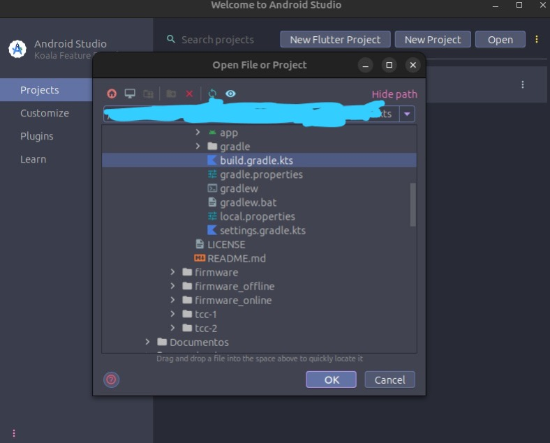
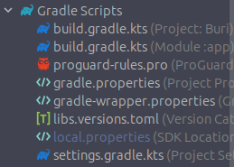
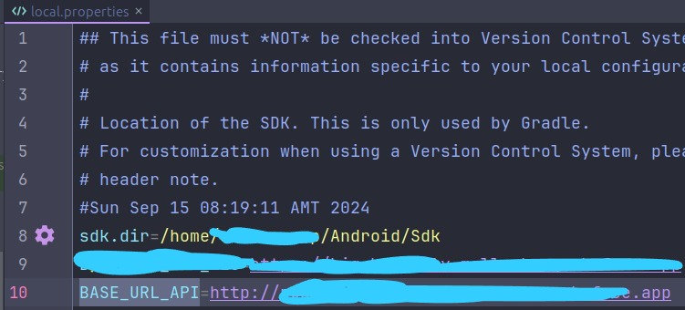

## Projeto BURI

### Autor : [Adevan Neves Santos](https://www.linkedin.com/in/adevancomp/)

### Orientador : [Prof. Jonathas Silva dos Santos](https://www.linkedin.com/in/jonathassilvasantos/)

#### Configuração do App com Android Studio

##### O que é Android Studio ?

##### Android Studio é um ambiente de desenvolvimento integrado (IDE) oficial para o desenvolvimento de aplicativos Android. Ele foi desenvolvido pelo Google e é baseado na plataforma IntelliJ IDEA. Android Studio oferece todas as ferramentas necessárias para criar, testar e depurar aplicativos Android.

##### Primeiro, certifique-se que você  tem o Android Studio  instalado na sua máquina. Caso contrário, instale-o pelo seguinte link  [link](https://developer.android.com/studio/install). 

##### Depois, baixe o código fonte da branch feat/app do repositório atual e armazene o código na pasta chamada app.

```bash
git clone git@github.com:adevancomp/TCC-Android-Embarcado-BURI.git -b feat/app app
```

### Com o Android Studio aberto, abra a pasta app/app e selecione o arquivo build.gradle.kts igual a imagen abaixo e clique em "ok", espere terminar de compilar: 



#### Na árvore do diretórios do lado esquerdo do projeto, abra o arquivo denominado "local.properties": 



#### E adicione a URL gerada no final do  tutorial da branch "feat/api" na variável BASE_URL_API: 



##### Recompile o projeto e gere o apk do aplicativo. 

##### Com o arquivo .apk gerado, compartilhe com seu dispositivo móvel e instale-o normalmente. 